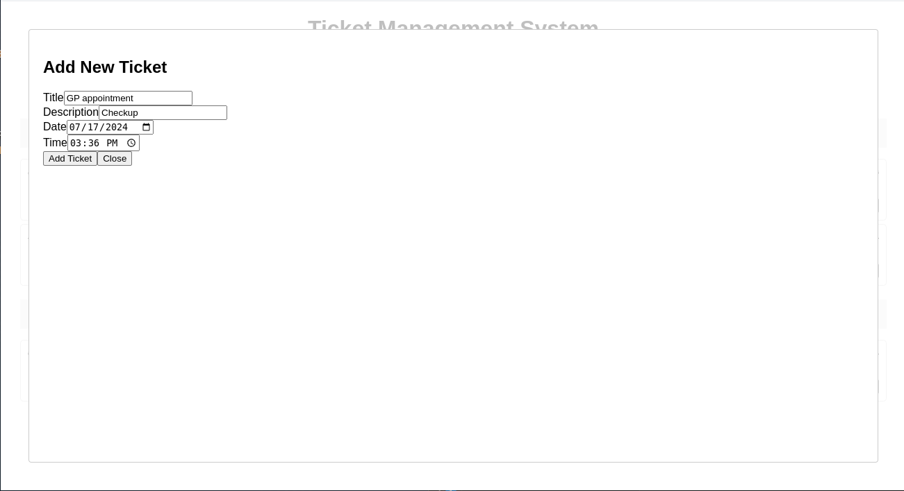
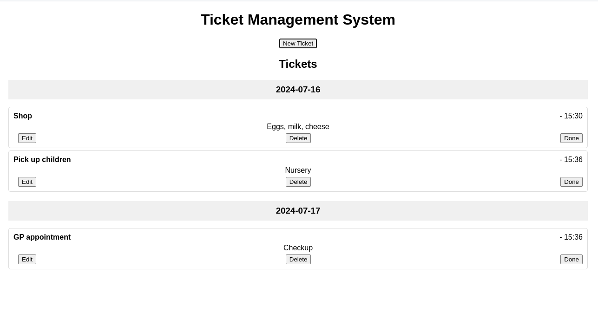
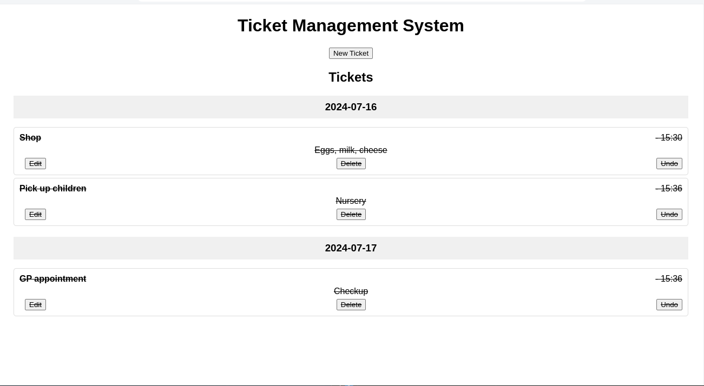
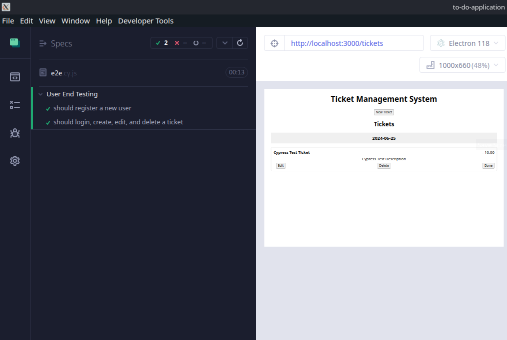
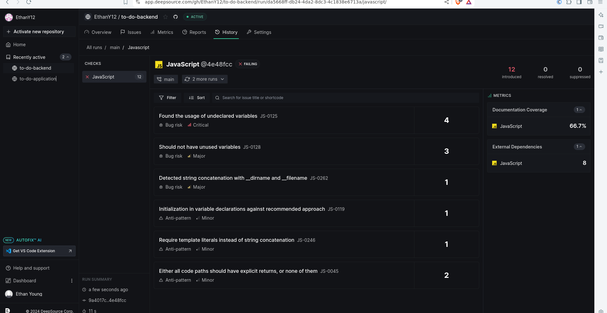

# Project desciption

Todo application for SQA assignment 2

# Project desciption

To-Do application lists tasks the user can create, the user can edit, delete, complete and add tasks. The tickets will be chronologically organised by date, enabling the user to keep track of their tasks on a day by day basis. A login and registration system has been included.

## Mock up designs

https://www.figma.com/design/KPuFlqNiBjxRl5Ld4mAZ7t/To-do-design?node-id=0-1&t=RNJoWK2lwhtavUKy-0

During development, the old calender design contained a drag and drop feature, were users could drag and drop their "to-do" tickets anywhere they liked, however this feature and grid system became rather diffcult to program.

A change in the design was required, rather than dragging and dropping ticket, tickets would be edited by the user were needed.

## Features

### Frontend

*Add new todo tasks
*Delete todo tasks
*Edit todo tasks
*Delete todo tasks
*Complete todo tasks
*Organise todo taks by date
\*Login and registration

## Backend

*SQL database
*CRUD(Create, read ,update, delete) ticket

A simplistic design was implemented to ensure ease of use and viewing. Additonally, ensuring a capability to organise 'to-do' tickets adhering to specified dates.

Empty todo task


Todo list with task


Todo tasks complete

Checked todo task

Create task


Cypress test


Deep source


## Team description

The following tasks were independently undertaken by Ethan Young, and therefore no team was required.

As the sole-member of this project Ethan Young undertook numerous roles to ensure the efficiency of all tasks including:
Providing QA testing
Creating application functionailty
Mock up and wire frames to provide an application overview.
CI/CD pratices
Code health tools
Project management
Project design
Documentation of application
Implementing code formatter
Code reviews
Automated testing
Scrum master

Intial stages:
Without a design or mock version of the application, development cannot be done without any clear intentions of features and designing.

With this in mind, a mock up was created using Figma

## Prerequisites

You will need the to-do-application and the to-do-backend application.

- Node.js
- npm or yarn

## Run application

-to-do-application

```bash
   git clone
   cd ../to-do-application
   npm i
   npm start
```

-to-do-backend

```bash
   git clone
   cd ../to-do-backend
   npm i
   npm start
```

## Run jest tests

### Run unit tests

to-do-application

```bash
   npm run test
```

to-do-backend

```bash
   npm run test
```

### Run jest integration tests

#### to-do-application

```bash
   npm run test:integration
```

#### to-do-backend

```bash
   npm run test:integration
```

### Run end to end user tests

### to-do-aoplication

```bash
   npx cypress open
```

A pop up should appear, select the e2e and click to continue. The end to end user tests will run.

Command to stop the service: ctrl+C

## Endpoints

The application has only ran through local host, all endpoints will be based on local host connections.

### Frontend

#### Login

https://localhost:3000/login

#### Register

https://localhost:3000/login

#### Tickets

https://localhost:3000/tickets

### Backend

Backend URL for the CRUD system

#### Get Tickets

List all tickets

http://localhost:5000/tickets

#### POST Tickets

This end points creates a new ticket

http://localhost:5000/tickets

Request Body
{
"title": "string",
"description": "string",
"date": "YYYY-MM-DD",
"time": "HH:MM"
}

#### PUT ticket

This end point allows the ticket to be updated

PUT http://localhost:5000/api/tickets/:id

Request Body
{
"title": "string",
"description": "string",
"date": "YYYY-MM-DD",
"time": "HH:MM"
}

#### DELETE ticket

This end point to delete a ticket

PUT http://localhost:5000/api/tickets/:id

Request Body
{
"title": "string",
"description": "string",
"date": "YYYY-MM-DD",
"time": "HH:MM"
}

#### PATCH ticket

This end point to delete a ticket

PATCH http://localhost:5000/api/tickets/:id/complete

Request Body
{
"title": "string",
"description": "string",
"date": "YYYY-MM-DD",
"time": "HH:MM"
}

## Tools

## Programming languages and modules

### Language

Javascript, CSS, HTML

### Modules

#### Frotend

*React
*React Router
*Axios
*React Modal
\*Cypress

#### Backend

*Express
*Body-Parser
*Cors
*Bcrypt
\*Morgan

## GitHub / Git

This project used 'Git' for version controlling. Github provides remote repository capabailities which can merge with master branch using Github. Each branch was named after a Jira ticket and then given a descriptive name e.g. "KAY-1-project-setup". Each branch was reviewed by Ethan to ensure functionailty and code quailty is healthy before being merged.

Github provides CI/CD pipelines which can automate the testing of code when branches are pushed, Guthub is used to automate the running of tests when a branch is pushed to Github.

### Deep source

Deep source is a tool that checks the quailty of the code for each branch before branches are merged into master, it's an automated process to check for duplication, code complexity, bugs and unused variables within the program. This follows SQA pratices by ensuring the code is always in a good condition.

### Node.js

Node.js provides both frontend and backend capabilities, allowing for a complete Javascript based program without the need of other languages.

Node.JS provides a large array of modules and packages which brings a lot of customisation to Javascipt and what can be done with it, such as ReactJS being a big component of this application.

### Testing

Jest provides a way of testing applications, by providing unit test, integration tests and snapshot tests and provides a easy to use command based analytics tools that provide stastics on failed tests and the reason and stastics on the amount of passed and failed tests.

### Prettier

Provides a tool to keep code within a consistant formatting when files are saved.

## Agile development

This project followed the Agile development approach. A Kanban styled development approach, were work will be visualised on a board. Tickets will be added to the board, reviewed when the task is finished and added to complete board once done.

Kanban focused on flexibilty of tasks, where tasks can be changed, added, or deleted. During the process of building the application, a redesign of the frontend was required to create an application that was easier to program. Kanban provides a flexiabilty waterfall fails to provide, waterfall requires tasks to be completed within a deadline without deviation.

### Retrospectives

Retrospectives were regularly conducted every three days to examine the progress made, discuss possible new directions, bugs and potential new features. A notepad was used to document progressions made during development to provide a reference.

### Jira board

To do - All tickets are stored on this column
In progress - Tickets currently being worked on will be stored in this board
Review - Once a merge request has been created, the tickets will be moved into this colum.
Done - Once merged, tickets will be added within the colum.

The board can be viewed: https://todoapp.atlassian.net/jira/software/projects/KAN/boards/1

## Testing Metholodly

![Credit: https://khorikov.org/posts/2021-01-04-unit-testing-vs-bdd/]https://khorikov.org/images/2020/2020-03-04-test-pyramid.png


In general unit tests should be the most frequent type of test, this is closer to code testing than user experience as only one function is tested.s

Integration test should be infrequent but should test multiple functions to understand their outcomes. Integration tests provides a way of simulating end user experience, ex example would be testing a registration system to understand outcomes that may occur.

End to end testing should be rare as they are expensive in terms of resources to simulate. These tests are done primarily to understand the end user experience.

Unit tests - Unit tests provide a method of testing each functionailty within the application. The advantage of this is to ensure each component on an indvidual level returns a value that is expected. Ensuring that each component within React does load correctly when the application starts.

Integration - Integration tests provides the ability to test multiple functions together, this allows for complex system to be checked. Within the application all React components were tested to ensure they worked together and had the desired functinailty.

Manuel testing - When a feature was added to the application, during the review process it would be teste by the reviewer to ensure the application was within a working order. A few examples are printing text to a command line was also conducted to test if buttons being clicked were being registered, or the login in system was logging in a user.

End to end testing - End to end provides the ability to test user registration, user login, creating a to-do task, editing a to-do task and deleting a to-do task, simulating the processes most commonly to occur within the application.


### CI/CD Pipeline

CI/CD

Within a continuous integration(CI) developing repository, where members will be adding new features. Continuous Development(CD) provides a way to run deployments and run tests. Deploying to an enviorment allows the developer to test the new features within live production enviroment.

A test pipeline runs automatically once a branch have been pushed, the pipelines test unit and integration tests only. A reviewer has the oppertunity to quickly establish if all test codes are meeting their expected outcomes.

With all tests conducted, the application code follows the SQA practices, ensuring all code is functioning according specfications and requirements.

## TODO

### Register and login:

Register and login system will need a token verfication system to indentify indivdual users, currently register and login all settings are applied to all accounts.

### Production and live enviroment

To test the system further, a testing website should exist to understand the visual and non-visual impacts of new featurs. A live enviroment should be created for users who wish to use the website.

### Tests

Completion of current and build further to ensure will thorough testing.
